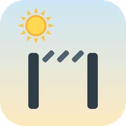

<p align="center">
  
</p>

<h1 align="center">Adaptive Pergola</h1>

<p align="center">
  Sun-, weather- and climate-aware automation for bioclimatic pergolas with adjustable louvres (louvered roofs) in Home Assistant.
</p>

<p align="center">
  <a href="https://github.com/hacs/integration"></a>
  <a href="https://github.com/B4S71/adaptive-pergola/releases"></a>
  
  <a href="#license"></a>
  <a href="https://github.com/RichardLitt/standard-readme"></a>
</p>

---

## Table of Contents

- [Background](#background)
- [Features](#features)
- [Requirements](#requirements)
- [Install](#install)
- [Configuration](#configuration)
- [Entities](#entities)
- [How it works](#how-it-works)
- [Relationship to Adaptive Cover Pro](#relationship-to-adaptive-cover-pro)
- [Development & AI assistance](#development--ai-assistance)
- [Contributing](#contributing)
- [License](#license)

## Background

A **bioclimatic pergola** is an outdoor shade structure whose roof is made of motorised **louvres (lamellas)** that rotate on a single axis — from flat/closed to fully open — to trade off sunlight, shade, airflow and rain protection.

**Adaptive Pergola** turns that hardware into a self-managing shade system in Home Assistant. Instead of a fixed schedule, it continuously computes the **target louvre angle** from the real sun position, your **roof geometry**, and live **weather** and **climate** conditions, then drives the actuator to match. The goal is simple: keep the terrace comfortable — block direct sun when it would glare or overheat, let light and warmth in when you want them, vent heat on hot days, and get out of the way when you take manual control.

It is designed for pergolas exposed via a Home Assistant `cover` entity that supports **tilt** (`set_tilt_position`) — for example Somfy IO / TaHoma bioclimatic pergolas through the Overkiz integration.

## Features

- **Sun-tracking louvre angle** — minimal-block pose and occupancy-shading geometry keep direct sun off the protected area as the sun moves; optional directional terrace extensions bias shading toward a chosen bearing.
- **Max-light mode** — an edge-on / profile-angle pose that maximises daylight when no shading is needed, with a two-regime (near/far sun) model that is axis-relative to your roof.
- **Shade-airflow pose** — a venting pose for hot conditions, optionally driven by inside-vs-outside temperature (`lr_airflow_by_temp`).
- **Climate mode** — summer/winter behaviour mapped onto roof-correct poses (winter → follow-sun for solar gain, summer → max-shade with airflow).
- **Morning position** — hold a low pose before and just after sunrise (condensation run-off / dawn gap), with an optional post-sunrise hold.
- **Weather protection** — wind, rain and lockout sensors, cloud suppression, and solar-forecast gating over the active window.
- **Manual override** — automatic detection of user commands, a configurable hold window, a reset button, and status sensors so automation resumes cleanly.
- **Building Profile** — share one sensor/weather configuration across several pergola sections.
- **Fully UI-configured** — geometry, kinematics calibration, climate, weather and behaviour are all set up through the config flow; no YAML required.
- **Optional managed proxy cover** — presents the pergola as a clean **tilt** cover and ships **position-driven slat icons** that visually track the current louvre angle (0 % flat → 100 % vertical).

## Requirements

- Home Assistant **2026.4.0** or newer.
- A pergola/louvre `cover` entity that supports **`set_tilt_position`** (the target the integration will control).
- [HACS](https://hacs.xyz/) for the recommended install path.

Python dependencies (`astral`, `pandas`) are installed automatically by Home Assistant.

## Install

### HACS (recommended)

1. In Home Assistant, open **HACS**.
2. Open the **⋮** menu → **Custom repositories**.
3. Add `https://github.com/B4S71/adaptive-pergola` with category **Integration**.
4. Search for **Adaptive Pergola**, download it, and **restart Home Assistant**.
5. Go to **Settings → Devices & Services → Add Integration** and choose **Adaptive Pergola**.

> Beta releases: enable *"show beta versions"* on the Adaptive Pergola entry in HACS to receive `0.4.0-betaN` pre-releases.

### Manual

1. Copy `custom_components/adaptive_pergola` into your Home Assistant `config/custom_components/` directory.
2. Restart Home Assistant.
3. Add the integration from **Settings → Devices & Services**.

## Configuration

Everything is configured through the **config flow** (and later editable via the entry's **Configure** button — no restart needed). The main steps:

1. **Target cover** — select the pergola cover entity to manage. It must expose `set_tilt_position`.
2. **Roof geometry** — describe the physical roof so the sun-tracking maths are correct:
   - axis azimuth (compass bearing of the louvre rotation axis) and plane pitch,
   - roof height and protected (terrace) height, and the protected footprint,
   - louvre chord, thickness and spacing,
   - travel limits `theta_min` / `theta_max`.
3. **Kinematics calibration** — `lr_tilt_vertical_pct`: the tilt-% at which the louvres stand vertical (90°). Real crank linkages are non-linear, so setting this anchors a two-segment angle↔percent curve for accurate commands. Leave blank for a linear map.
4. **Climate** — inside/outside temperature sensors, thresholds, and the summer/winter climate mode.
5. **Weather** — wind/rain/lockout sensors or templates, cloud coverage, and solar-forecast gating.
6. **Behaviour** — max-light and rest poses, shade-airflow, morning position, manual-override hold window, and optional debug categories.
7. **Movement** — delta thresholds between commands, the active time window, and an optional **end-stop re-sync** (`resync_travel_threshold`): after the configured amount of accumulated commanded travel, the next move detours via the nearest mechanical end stop to re-reference a drifting slat motor before continuing to the target. Recommended for actuators that execute small tracking steps imprecisely.

Sensible defaults are provided throughout; at minimum you need the target cover and the roof geometry.

## Entities

Once configured, the integration creates (names prefixed by your pergola's name):

- **Sensors** — control status / decision trace and related diagnostics.
- **Switches** — master enable, automatic control, sun tracking, manual toggle, climate mode, temperature/lux/irradiance gating, and per-zone glare toggles.
- **Binary sensors** — sun-in-motion, manual override active, glare active, position mismatch.
- **Button** — reset manual override.
- **Number** — "My" position value.
- **Cover** *(optional, opt-in)* — the managed proxy cover with position-driven slat icons.

## How it works

Each update cycle the integration builds a snapshot of the sun position, roof geometry, weather and climate, then runs a small **decision pipeline**: safety/weather overrides and manual override take precedence, otherwise the sun-tracking engine computes the pose that blocks direct sun on the protected area (or the max-light / rest pose when nothing needs shading). The resulting louvre angle is converted through your kinematics calibration and sent to the cover's tilt axis. Manual commands are detected and respected for a configurable window before automation resumes.

## Relationship to Adaptive Cover Pro

Adaptive Pergola started as the **louvered-roof branch** of [**Adaptive Cover Pro**](https://github.com/jrhubott/adaptive-cover-pro) (`B4S71/adaptive-cover-pro`, branch `contrib/louvered-roof-pergola`). Its calculation engine, coordinator, pipeline, managers and config flow are an excellent, battle-tested foundation, and building on them was a great way to get a capable pergola integration off the ground quickly.

Rather than upstreaming the pergola work back into Adaptive Cover Pro, we deliberately chose to maintain **Adaptive Pergola as an independent, standalone integration** (its own domain `adaptive_pergola`, all non-pergola cover types removed). This keeps pergola-specific features **decoupled from Adaptive Cover Pro's main development cycle**, so they can be designed, iterated and released on their own cadence without being constrained by — or constraining — the upstream project. The shared foundation was taken over as-is so relevant fixes from upstream remain portable by diff.

Full credit for the underlying engine and architecture goes to the Adaptive Cover Pro authors. See [License](#license) for attribution.

## Development & AI assistance

In the interest of transparency: parts of this project are developed with the help of **AI coding agents**, used to speed up development, refactoring, testing and documentation. Changes are reviewed before release, but you should expect AI-assisted contributions in the history. If you spot something that looks off, please open an issue — that feedback is genuinely useful.

## Contributing

Issues and pull requests are welcome. For bug reports, please include your Home Assistant version, the pergola/cover integration you use, and (where relevant) a decision-trace or debug log.

- Issues: <https://github.com/B4S71/adaptive-pergola/issues>
- Run the test suite locally:

  ```bash
  pip install -e ".[dev]"
  python -m pytest -q
  ```

## License

Adaptive Pergola is released under the **MIT License** — see [`LICENSE`](LICENSE).

It is a derivative work of [Adaptive Cover Pro](https://github.com/jrhubott/adaptive-cover-pro) by jrhubott, also MIT-licensed. The original copyright notice is preserved in `LICENSE` as required by the MIT terms.
